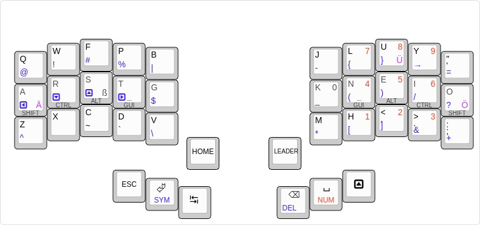

# MODVIM
Pinky3 Keyboard based on Colemak Mod DH with focus on support for VIM and German.

## Installation
After checkint out this repository a symlink should be created to the keymap
section of the QMK directory:
```bash
ln -s ~/<PATH TO REPO>/pinky3-modvim/ ~/<QMK>/keyboards/pinky/3/keymaps/modvim
```

### Building
The code can be compiled:
```bash
qmk compile -kb pinky/3 -km modvim
```

### Flashing
The code can finally be flashed:
```bash
qmk flash -kb pinky/3 -km modvim -bl dfu
```

**Note:** The `-bl dfu` depends on the HW used (i.e. it may not be needed)

## Leader Key
The following leader key mappings have been implemented:
| Leader Key | Mapping |
| ---------- | ------- |
| <kbd>i</kbd><kbd>a</kbd> | <kbd>LGUI</kbd> + <kbd>1</kbd> |
| <kbd>i</kbd><kbd>r</kbd> | <kbd>LGUI</kbd> + <kbd>2</kbd> |
| <kbd>i</kbd><kbd>s</kbd> | <kbd>LGUI</kbd> + <kbd>3</kbd> |
| <kbd>i</kbd><kbd>t</kbd> | <kbd>LGUI</kbd> + <kbd>4</kbd> |
| <kbd>i</kbd><kbd>g</kbd> | <kbd>LGUI</kbd> + <kbd>5</kbd> |
| <kbd>q</kbd> | <kbd>LGUI</kbd> + <kbd>Q</kbd> |

## Layers



Images and .json files are generated by http://www.keyboard-layout-editor.com/
